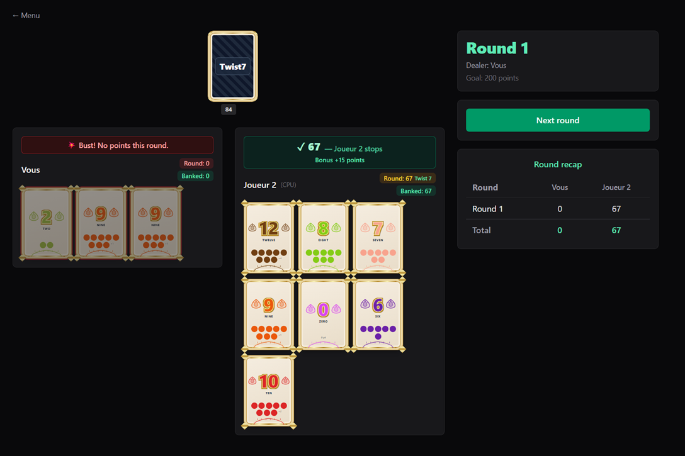

# 🃏 Twist7

A web implementation of the **Twist7** card game, playable solo, against the AI, or with multiple human players. Built with React, TypeScript, Vite, Tailwind CSS, TanStack Router and TanStack Query.

## 🖼️ Screenshot



## ✨ Features

- **Game modes**: 1 player (vs AI), Human vs AI, or Human vs Human (up to 6 players).
- **Pure game engine** (TypeScript, no React) strictly following the official rulebook.
- **AI opponents** with adjustable risk-taking ("push your luck") logic: easy / medium / hard.
- **Interface**: central draw pile, large cards, and a responsive layout that adapts to the number of players (side-by-side for 2, grid for 3+).
- **Score recap** at the end of every round (per-round scores + cumulative total), with automatic round advancement when all players are AI.
- **Second Chance cards** that can be played and manually discarded in case of a duplicate.
- **Rules** available in a modal window and in the `RULES.md` file.
- **Multilingual**: English / French / Spanish.

## 🚀 Getting Started

### Quick method (Windows)

Double-click **`run.bat`**. It automatically installs dependencies (if needed) and then starts the development server.

### From the command line

```bash
# 1. Install dependencies
npm install

# 2. Start the development server
npm run dev
```

The game will be available at **http://localhost:5173**.

### Production build

```bash
npm run build      # generates the dist/ folder
npm run preview    # previews the production build
```

## 🧪 Tests

The game engine is covered by unit tests (Vitest):

```bash
npm run test       # run all tests
```

## 🗂️ Project Structure

```
src/
  engine/        # Pure game engine (types, deck, twist7Engine) + tests
  ai/            # AI strategies (easy / medium / hard)
  components/    # UI components (Card, DeckPile, ScoreTable, RulesModal, LanguageSwitcher)
  hooks/         # useTwist7Game, useAiMove
  i18n/          # Translation system (fr/en/es)
  routes/        # Pages (menu, setup, game.$mode) via TanStack Router
RULES.md         # Official game rules
```

## 📖 Rules

See `RULES.md` or click the **"Rules"** button in the app header.

> **Goal**: be the first to reach **200 points** by collecting numbered cards without ever drawing a duplicate. Gathering **7 different numbered cards** triggers a **Twist 7** (immediate end of the round + 15 bonus points).

---

# 🃏 Twist7 (Français)

Une implémentation web du jeu de cartes **Twist7**, jouable en solo, contre l'IA ou à plusieurs joueurs humains. Construit avec React, TypeScript, Vite, Tailwind CSS, TanStack Router et TanStack Query.

## 🖼️ Capture d'écran


## ✨ Fonctionnalités

- **Modes de jeu** : 1 joueur (contre l'IA), Humain vs IA, ou Humain vs Humain (jusqu'à 6 joueurs).
- **Moteur de jeu pur** (TypeScript, sans React) strictement conforme au livret de règles officiel.
- **Adversaires IA** avec logique de prise de risque (push your luck) réglable : facile / moyen / difficile.
- **Interface** : pioche centrale, cartes agrandies, et **disposition responsive** qui s'adapte au nombre de joueurs (côte à côte à 2, grille à 3 et plus).
- **Récapitulatif des scores** à la fin de chaque manche (scores par manche + total cumulé), avec passage automatique à la manche suivante quand tous les joueurs sont des IA.
- **Cartes Seconde Chance** utilisables et défaussées manuellement en cas de doublon.
- **Règles** consultables dans une fenêtre modale et dans le fichier `RULES.md`.
- **Multilingue** : anglais / français / espagnol.

## 🚀 Lancer le jeu

### Méthode rapide (Windows)

Double-cliquez sur **`run.bat`**. Il installe automatiquement les dépendances (si besoin) puis démarre le serveur de développement.

### En ligne de commande

```bash
# 1. Installer les dépendances
npm install

# 2. Démarrer le serveur de développement
npm run dev
```

Le jeu sera accessible sur **http://localhost:5173**.

### Build de production

```bash
npm run build      # génère le dossier dist/
npm run preview    # prévisualise le build de production
```

## 🧪 Tests

Le moteur de jeu est couvert par des tests unitaires (Vitest) :

```bash
npm run test       # lance tous les tests
```

## 🗂️ Structure du projet

```
src/
  engine/        # Moteur de jeu pur (types, deck, twist7Engine) + tests
  ai/            # Stratégies IA (facile / moyen / difficile)
  components/    # Composants UI (Card, DeckPile, ScoreTable, RulesModal, LanguageSwitcher)
  hooks/         # useTwist7Game, useAiMove
  i18n/          # Système de traduction (fr/en/es)
  routes/        # Pages (menu, setup, game.$mode) via TanStack Router
RULES.md         # Règles officielles du jeu
```

## 📖 Règles du jeu

Consultez `RULES.md` ou cliquez sur le bouton **« Règles »** dans l'en-tête de l'application.

> **But du jeu** : être le premier à atteindre **200 points** en collectant des cartes numérotées sans jamais obtenir de doublon. Réunir **7 cartes numéro différentes** déclenche un **Twist 7** (fin de manche immédiate + 15 points de bonus).

---

# 🃏 Twist7 (Español)

Una implementación web del juego de cartas **Twist7**, jugable en solitario, contra la IA o con varios jugadores humanos. Construido con React, TypeScript, Vite, Tailwind CSS, TanStack Router y TanStack Query.

## 🖼️ Captura de pantalla


## ✨ Características

- **Modos de juego**: 1 jugador (contra la IA), Humano vs IA, o Humano vs Humano (hasta 6 jugadores).
- **Motor de juego puro** (TypeScript, sin React) que sigue estrictamente el libro de reglas oficial.
- **Oponentes IA** con lógica de asunción de riesgos ("push your luck") ajustable: fácil / medio / difícil.
- **Interfaz**: mazo central, cartas grandes y un **diseño adaptable** al número de jugadores (uno al lado del otro con 2, cuadrícula con 3 o más).
- **Resumen de puntuación** al final de cada ronda (puntos por ronda + total acumulado), con avance automático de ronda cuando todos los jugadores son IA.
- **Cartas de Segunda Oportunidad** que se pueden jugar y descartar manualmente en caso de duplicado.
- **Reglas** disponibles en una ventana modal y en el archivo `RULES.md`.
- **Multilingüe**: inglés / francés / español.

## 🚀 Cómo empezar

### Método rápido (Windows)

Haga doble clic en **`run.bat`**. Instala automáticamente las dependencias (si es necesario) y luego inicia el servidor de desarrollo.

### Desde la línea de comandos

```bash
# 1. Instalar las dependencias
npm install

# 2. Iniciar el servidor de desarrollo
npm run dev
```

El juego estará disponible en **http://localhost:5173**.

### Compilación de producción

```bash
npm run build      # genera la carpeta dist/
npm run preview    # previsualiza la compilación de producción
```

## 🧪 Pruebas

El motor del juego cuenta con pruebas unitarias (Vitest):

```bash
npm run test       # ejecuta todas las pruebas
```

## 🗂️ Estructura del proyecto

```
src/
  engine/        # Motor de juego puro (tipos, deck, twist7Engine) + pruebas
  ai/            # Estrategias de IA (fácil / medio / difícil)
  components/    # Componentes de UI (Card, DeckPile, ScoreTable, RulesModal, LanguageSwitcher)
  hooks/         # useTwist7Game, useAiMove
  i18n/          # Sistema de traducción (fr/en/es)
  routes/        # Páginas (menú, setup, game.$mode) con TanStack Router
RULES.md         # Reglas oficiales del juego
```

## 📖 Reglas del juego

Consulte `RULES.md` o haga clic en el botón **« Reglas »** en la cabecera de la aplicación.

> **Objetivo**: ser el primero en alcanzar **200 puntos** reuniendo cartas numeradas sin obtener nunca un duplicado. Conseguir **7 cartas numeradas diferentes** desencadena un **Twist 7** (fin inmediato de la ronda + 15 puntos de bonificación).
